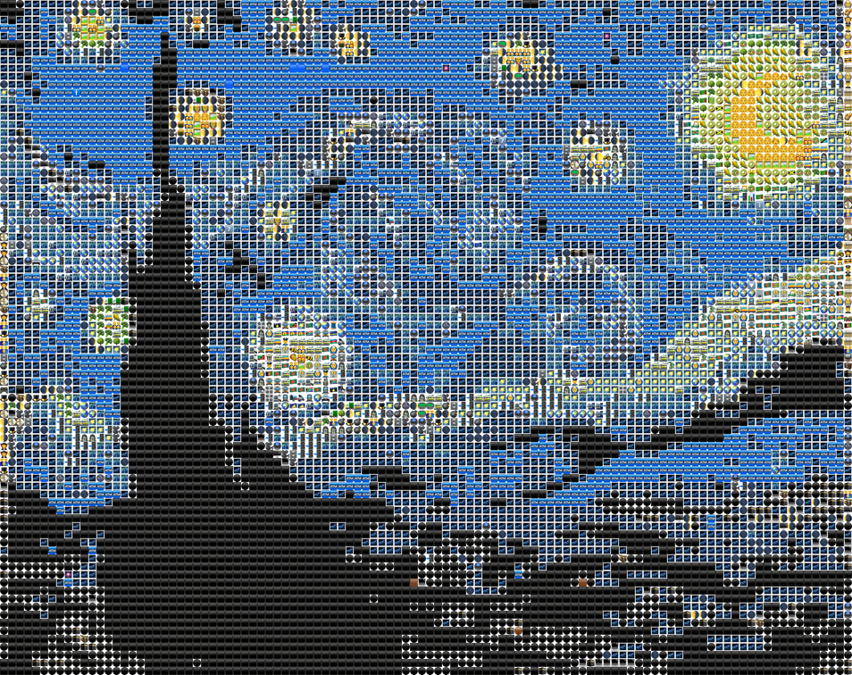
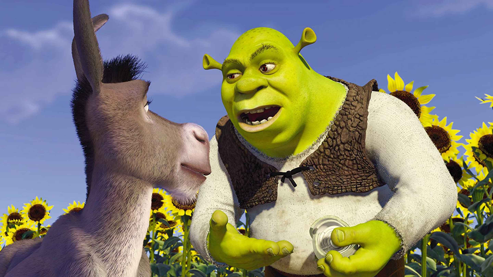
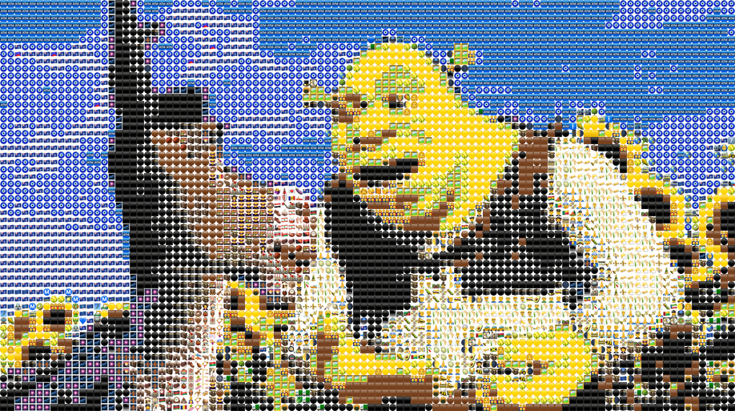

# Emoji Art

## Overview

This project takes images/video input and gives you emojis out.

Input             |  Output
:-------------------------:|:-------------------------
  |  
  |  

## Usage

Before you start you must first generate the lookup map;

```
node src/generate-lookup.js -i emojis.json
```

Once this is complete you will see a new file called lookup.png. You can now use this to generate a final mosaic;

```
node src/generate-mosaic.js -i input/shrek.jpg -m emojis.json -l lookup.png -w 100 -o output/shrek.png
```
